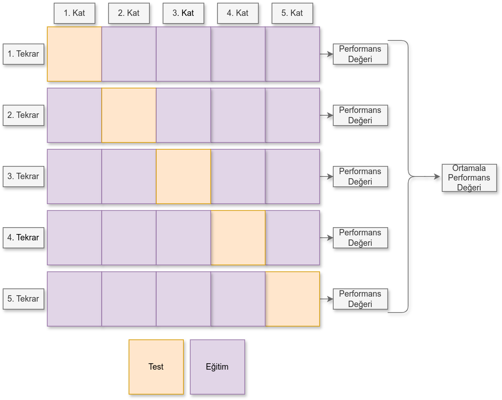

## Modelinizi Sınava Sokmak: Çapraz Doğrulama ve K-Katlı Çapraz Doğrulama Nedir?

Makine öğrenimiyle uğraşan herkesin aslında tek bir dileği var: Kurduğumuz model, okulda öğrendiği her şeyi unutup gerçek hayatta karşısına çıkan bambaşka verilerle de başarılı olsun. Yani, modelimiz öyle sadece ezber yapmasın, konuyu gerçekten anlasın. Tıpkı sınava hazırlanan bir öğrencinin, sadece soru ezberlemekle kalmayıp, konuyu kökünden anlayıp önüne gelen her türlü soruyu çözebilmesi gibi.

İşte tam da bu noktada **Çapraz Doğrulama (Cross-Validation)** sahneye çıkıyor. Bu yöntem, modelimizin sadece daha önce "gördüğü" verilerde değil, hiç görmediği, yepyeni verilerde ne kadar başarılı tahminler yapabildiğini anlamamıza yardımcı olan harika bir teknik.

Peki, etrafta sıkça duyduğumuz **K-Katlı Çapraz Doğrulama (K-Fold Cross-Validation)** tam olarak neyin nesi? Çapraz doğrulama ile nasıl bir ilişkisi var? Gelin, bu kavramları hiç kafa karıştırmadan, en sade haliyle açıklayalım.


### Çapraz Doğrulama Nedir?

Çapraz doğrulama, aslında modelinizin ne kadar iyi olduğunu daha güvenilir bir şekilde ölçmek için, elinizdeki veriyi birden fazla farklı parçaya bölüp, her seferinde modelinizi farklı bir parça üzerinde test etmenizi sağlayan bir değerlendirme stratejisi.

Genellikle ne yaparız? Veri setimizi ikiye böleriz: %80'ini modele öğretmek için kullanırız, %20'sini de modelin öğrendiklerini test etmek için. Ama bu tek seferlik bölme bazen yanıltıcı olabilir, değil mi? Belki test setimiz çok kolay çıktı da modelimiz olduğundan daha zeki göründü, ya da tam tersi, çok zor çıktı da haksız yere kötü not aldı.

İşte tam bu yüzden çapraz doğrulama der ki: "Gel arkadaşım, veriyi tek bir şekilde bölmekle kalma. Farklı farklı şekillerde böl, her seferinde başka bir kısmını test için kullan. Böylece modelinin genel başarısını daha doğru bir şekilde anlarsın."

Burada küçücük ama önemli bir noktaya dikkat:

**`train_test_split`** fonksiyonuyla yaptığımız o bildiğimiz tek seferlik ayırma, çapraz doğrulama değildir. Çapraz doğrulama, veriyi en az iki veya daha fazla kez bölerek modelin farklı veri alt kümelerinde test edilmesini sağlayan daha kapsamlı bir yaklaşımdır.


### Basit Bir Veri Bölme Örneği (`train_test_split`)

Bu örnek, yalnızca tek bir eğitim/test bölmesini gösteriyor; yani henüz çapraz doğrulama yapmıyoruz, sadece modelin ilk sınavını hazırlıyoruz:

```python
from sklearn.model_selection import train_test_split
from sklearn.datasets import load_iris
from sklearn.tree import DecisionTreeClassifier
from sklearn.metrics import accuracy_score

# Veri setimizi yükleyelim
X, y = load_iris(return_X_y=True)

# Veriyi eğitim ve test olarak ayıralım
X_train, X_test, y_train, y_test = train_test_split(X, y, test_size=0.2, random_state=42)

# Modeli eğitelim
model = DecisionTreeClassifier()
model.fit(X_train, y_train)

# Test verisiyle tahmin yapalım
y_pred = model.predict(X_test)
print("Doğruluk:", accuracy_score(y_test, y_pred))
```


### K-Katlı Çapraz Doğrulama Nedir?

K-Katlı Çapraz Doğrulama, çapraz doğrulamanın en sevilen, en çok kullanılan yöntemlerinden biri. Adı biraz karmaşık gelse de mantığı çok basit ve etkili:

  * Veri setinizi **K** tane eşit parçaya (bunlara "kat" veya "fold" diyoruz) ayırırsınız.
  * Sonra bir döngü başlar: Her seferinde bu K parçadan **bir tanesini test seti olarak kullanırsınız**, geri kalan K-1 parçayı ise birleştirip modelinizi eğitmek için kullanırsınız.
  * Bu işlemi tam **K** kez tekrarlarsınız. Yani her kat bir kez test seti olur. Her seferinde model yeniden eğitilir ve test edilir.
  * En sonunda **K** farklı test sonucu elde edersiniz ve genellikle bu sonuçların **ortalamasını** alarak modelinizin gerçek performansını belirlersiniz.

Aşağıdaki görselde K değeri 5 verilen bir K-Katlı Çapraz Doğrulama diyagramını görebilirsiniz.
 


### K-Katlı Çapraz Doğrulama Python Örneği

Şimdi bunu Python'da nasıl yaparız, ona bakalım. Gayet temiz ve anlaşılır:

```python
from sklearn.model_selection import KFold, cross_val_score
from sklearn.datasets import load_iris
from sklearn.tree import DecisionTreeClassifier

X, y = load_iris(return_X_y=True)
model = DecisionTreeClassifier()

# K-Katlı Çapraz Doğrulama yapıyoruz (örnekte k değerini 5 veriyoruz)
kf = KFold(n_splits=5, shuffle=True, random_state=42) # Veriyi 5'e bölüyoruz
scores = cross_val_score(model, X, y, cv=kf) # Her bir kat için modelimiz test edilir
print("Her bir kat için elde edilen doğruluk skorları:", scores)
print("Ortalama doğruluk:", scores.mean())
```


### Derin Sinir Ağlarında (Keras ile) K-Katlı Çapraz Doğrulama Nasıl Kullanılır?

K-Katlı Çapraz Doğrulama, sadece klasik makine öğrenimi algoritmaları için değil, derin öğrenme modelleri için de harika bir araç. Ama Keras gibi kütüphanelerde ufak bir fark var: Her bir kat için modeli baştan oluşturmanız gerekiyor. Çünkü bir Keras modeli bir kere eğitildikten sonra, içindeki öğrenilmiş bilgileri sıfırlayıp baştan eğitim için hazırlamak mümkün değil.

Aşağıda, Keras ile basit bir yapay sinir ağı için K-Katlı Çapraz Doğrulama örneğini bulabilirsiniz. Biraz daha detaylı gözükebilir ama mantık hala aynı:

```python
import numpy as np
from sklearn.model_selection import KFold
from tensorflow import keras
from tensorflow.keras import layers
from sklearn.datasets import load_iris
from sklearn.preprocessing import OneHotEncoder

# Veri setimizi yükleyelim ve hazırlayalım
X, y = load_iris(return_X_y=True)
y = y.reshape(-1, 1)
encoder = OneHotEncoder(sparse_output=False)
y_encoded = encoder.fit_transform(y)

kf = KFold(n_splits=5, shuffle=True, random_state=42)
acc_scores = [] # Doğruluk skorlarını burada tutacağız

for train_idx, test_idx in kf.split(X):
    X_train, X_test = X[train_idx], X[test_idx]
    y_train, y_test = y_encoded[train_idx], y_encoded[test_idx]

    # Her kat için yeni bir model oluşturuyoruz
    model = keras.Sequential([
        layers.Dense(16, activation='relu', input_shape=(X.shape[1],)),
        layers.Dense(8, activation='relu'),
        layers.Dense(3, activation='softmax')
    ])
    model.compile(optimizer='adam', loss='categorical_crossentropy', metrics=['accuracy'])

    # Modeli eğitiyoruz (verbose=0 ile sessiz modda)
    model.fit(X_train, y_train, epochs=30, batch_size=8, verbose=0)
    # Modelin performansını test ediyoruz
    loss, acc = model.evaluate(X_test, y_test, verbose=0)
    acc_scores.append(acc) # Skoru listemize ekliyoruz

print("Her bir kat için elde edilen doğruluk skorları:", acc_scores)
print("Ortalama doğruluk:", np.mean(acc_scores))
```

**Küçük bir hatırlatma:** Keras ile K-Katlı Çapraz Doğrulama yaparken, her bir kat için modeli sıfırdan oluşturmanız gerektiğini unutmayın.

Bu yöntem sayesinde, derin öğrenme modellerinizin farklı veri bölünmelerinde nasıl davrandığını çok daha güvenilir bir şekilde görebilirsiniz. Özellikle veri setiniz çok büyük değilse veya modelinizin "genelleme yeteneğini" yani hiç görmediği verilere ne kadar iyi uyum sağlayabildiğini test etmek istiyorsanız, K-Katlı Çapraz Doğrulama size altın değerinde bilgiler sunacaktır\!